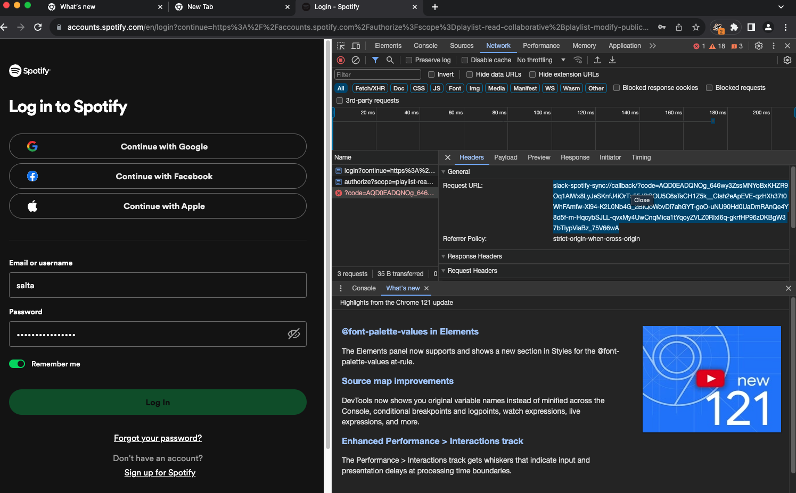

# spotify-slack-sync-fredagslistan

## get started

- Use pyenv
```
pyenv install
```
Will pick up the .python-version file and install the correct version of python

- install requirements
```
pip install -r requirements.txt
```

- Run the program
```
python main.py (or in this case slack-spotify-sync.py)
```

## Features
- Checks if there's a Spotify playlist for the current day. If not, it creates one.
  This isn't done yet, it uses an existing playlist for now.
- Retrieves the day's messages from a specified Slack channel.
- Retrieves the current day's tracks from the Spotify playlist.
- Compares the Slack messages with the Spotify playlist and identifies new tracks.
- Adds any new tracks from Slack to the Spotify playlist.
- Announces the updated playlist in Slack (once per day).
  This isn't done yet, what should be feed back into Slack?


## Progress
  - [x] Kollar på att bygga om Jonas Fredags lista grej till till en egen funktion som kör bara på fredagar och typ var 10 minut
  - [x] jämför vad som ligger i listan och adderar bara det som är nytt
  - [x] skriva den i typescript med tester
  - [x] skaffa en spotify token som gäller hela tiden
  - [x] skaffa en slack token för att kolla vad som finns i listan
  - [x] dra ner allt i slack (som skrivits idag)
  - [x] dra ner allt från fredagslistan (som adderats idag)
  - [x] jämföra dom två listorna med varandra
  - [x] ta bort allt som är samma ...
  - [x] skicka upp det som finns kvar i array'en till spotify

  - [x] Check spotify token
  - [x] Check slack token

  - [x] Get list from today in slack
  - [x] Get list from spotify
  - [x] Compare both lists

  - [ ] Check if there is a playlist for today in spotify
    - [ ] - If there is no playlist for today, create a new playlist, save the ID in a variable
    - [ ] - If there is a playlist already save the id in a variable

  - [ ] Add the remaning array to spotify playlist

  - [ ] Announce the playlist in slack (only do this once per day)
    - [ ] - Maybe add comment in thread about the number of added songs each time it runs.


## Oauth for spotify
urgh
we need to authenticate with spotify and this can be done by getting the redirect url from the browserand then pasting it in when the terminal asks for it

```
Enter the URL you were redirected to:
```

Paste in something like this
```
slack-spotify-sync://callback/?code=AQD0EADQNOg_646wy3ZssMNYoBxKHZR9Oq1AlWx8LyJeSKnfJ4iOrTx55JDCOU5C6sTsCH1Z5k__CIsh2eApEVE-qzHXh37t0WhFAmfw-Xl94-K2L0Nb4G_2BIQoWovDl7ahGYT-goO-uNU90Hd0UaDmRAnQe4Y8d5f-m-HqcybSJLL-qvxMy4UwCnqMica1tYqoyZVLZ0RIxI6q-gkrfHP96zDKBgW37bTiypViaBz_75V66wA
```

